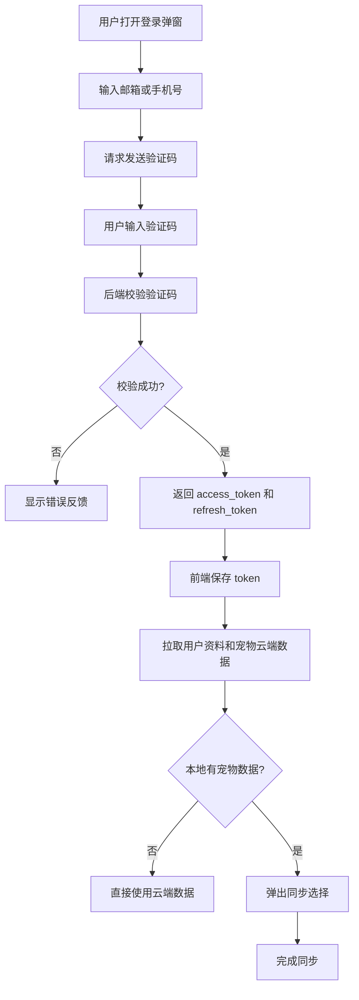

# 七月播放器登录模块设计

## 1. 目标

登录模块用于让用户在不同设备之间同步账号数据、宠物数据、商店资产、签到奖励、视频奖励和 AI token 消耗记录。

核心目标：

| 目标 | 说明 |
| --- | --- |
| 账号登录 | 支持手机号、邮箱、第三方登录中的一种或多种。 |
| 数据同步 | 宠物等级、经验、代币、道具、商店购买记录可以保存到后端。 |
| 安全授权 | 使用 access token + refresh token，避免长期暴露登录凭证。 |
| 可离线使用 | 未登录时仍可本地使用播放器；登录后再同步数据。 |
| 可扩展 | 后续可扩展会员、云端课程记录、账号中心、设备管理。 |

## 2. 推荐登录方式

第一阶段建议先做：

| 登录方式 | 是否推荐 | 原因 |
| --- | --- | --- |
| 邮箱 + 验证码 | 推荐 | 实现简单，不需要密码找回流程。 |
| 手机号 + 验证码 | 推荐 | 国内用户体验好，但需要短信服务。 |
| 账号密码 | 可选 | 需要密码加密、找回、风控，复杂度更高。 |
| GitHub / Google 登录 | 后续 | 国内访问可能不稳定。 |

建议优先上线：

```text
邮箱验证码登录 + 手机号验证码登录
```

## 3. 前端页面拆分

| 页面 / 弹窗 | 功能 |
| --- | --- |
| 登录弹窗 | 输入邮箱/手机号，获取验证码，完成登录。 |
| 账号中心 | 展示头像、昵称、UID、登录状态、同步状态。 |
| 宠物云同步提示 | 登录后提示是否把本地宠物数据同步到云端。 |
| 设备冲突弹窗 | 本地数据和云端数据冲突时，让用户选择保留本地或云端。 |
| 退出登录确认 | 退出后保留本地数据，但停止云同步。 |

## 4. 登录流程



## 5. Token 策略

| Token | 建议有效期 | 存储位置 | 用途 |
| --- | --- | --- | --- |
| `access_token` | 2 小时 | 系统安全存储或本地加密存储 | 调用业务接口。 |
| `refresh_token` | 30 天 | 系统安全存储或本地加密存储 | 静默刷新登录态。 |
| `device_id` | 长期 | 本地设置 | 区分不同设备。 |

推荐：

```text
access_token 过期后，用 refresh_token 自动刷新。
refresh_token 过期后，让用户重新登录。
```

## 6. 后端接口设计

### 6.1 发送验证码

```http
POST /api/auth/send-code
Content-Type: application/json
```

```json
{
  "account": "user@example.com",
  "scene": "login"
}
```

返回：

```json
{
  "ok": true,
  "cooldown_seconds": 60
}
```

### 6.2 验证码登录

```http
POST /api/auth/login-code
Content-Type: application/json
```

```json
{
  "account": "user@example.com",
  "code": "123456",
  "device_id": "device_xxx",
  "device_name": "Windows Desktop"
}
```

返回：

```json
{
  "access_token": "jwt_access_token",
  "refresh_token": "jwt_refresh_token",
  "expires_in": 7200,
  "user": {
    "id": "user_001",
    "nickname": "七月用户",
    "avatar_url": "",
    "created_at": "2026-06-17T12:00:00Z"
  }
}
```

### 6.3 刷新 token

```http
POST /api/auth/refresh
Content-Type: application/json
```

```json
{
  "refresh_token": "jwt_refresh_token",
  "device_id": "device_xxx"
}
```

### 6.4 获取当前用户

```http
GET /api/me
Authorization: Bearer <access_token>
```

### 6.5 退出登录

```http
POST /api/auth/logout
Authorization: Bearer <access_token>
```

```json
{
  "refresh_token": "jwt_refresh_token",
  "device_id": "device_xxx"
}
```

## 7. 数据同步策略

| 场景 | 推荐策略 |
| --- | --- |
| 未登录使用 | 数据只保存在本地。 |
| 第一次登录 | 拉取云端数据，如果云端为空，把本地宠物数据上传。 |
| 云端和本地都有数据 | 弹窗让用户选择：使用本地、使用云端、尝试合并。 |
| 正常使用中 | 关键操作立即上传，例如升级、购买、签到、领取奖励。 |
| 网络失败 | 本地写入同步队列，后续自动重试。 |

## 8. 前端状态设计

| 状态 | 说明 |
| --- | --- |
| `guest` | 未登录，游客模式。 |
| `authenticating` | 正在登录或刷新 token。 |
| `authenticated` | 已登录。 |
| `syncing` | 正在同步用户和宠物数据。 |
| `sync_failed` | 同步失败，但本地可继续使用。 |

## 9. 安全要求

| 项目 | 要求 |
| --- | --- |
| 验证码 | 6 位数字，5 分钟有效，同一账号 60 秒内只能发送一次。 |
| 密码 | 如果后续支持密码，必须使用 bcrypt / argon2 哈希。 |
| Token | access token 短期有效，refresh token 可撤销。 |
| 设备 | 每个登录设备生成独立 `device_id`。 |
| 风控 | 同一 IP、同一账号发送验证码需要限流。 |
| 日志 | 不记录明文验证码、token、API Key。 |

## 10. UI 操作反馈

| 操作 | 反馈 |
| --- | --- |
| 发送验证码成功 | 显示倒计时按钮。 |
| 验证码错误 | 输入框下方显示错误，并允许重新输入。 |
| 登录成功 | Toast：登录成功，正在同步数据。 |
| 同步成功 | Toast：宠物数据已同步。 |
| 同步失败 | Toast：网络异常，已保存到本地，稍后自动同步。 |
| 退出登录 | 弹窗确认：退出后将停止云同步。 |

## 11. 第一阶段上线范围

建议第一阶段只做下面这些：

| 功能 | 是否上线 |
| --- | --- |
| 邮箱验证码登录 | 是 |
| 用户资料接口 | 是 |
| 宠物数据云同步 | 是 |
| 商店购买记录保存 | 是 |
| 签到和视频奖励记录 | 是 |
| 多设备冲突合并 | 简化版 |
| 账号密码 | 暂缓 |
| 第三方登录 | 暂缓 |
